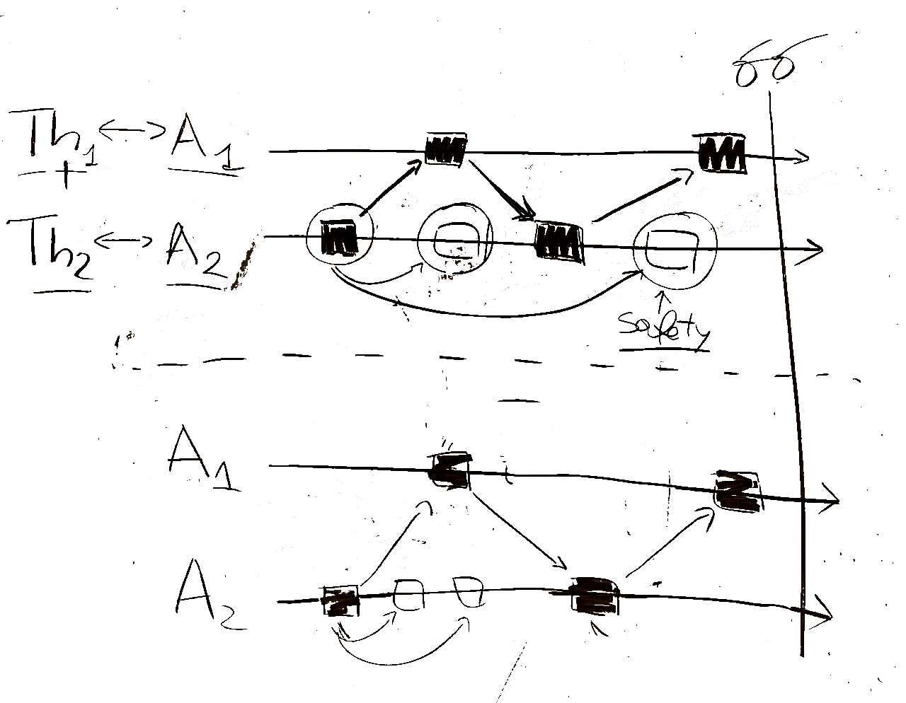

# src

Actors are represented by `actor(A)` facts, 
where `A` is an actor identifier.

Computing units are represented similarly by `cu(U)` facts,
where `U` is a computing unit identifier (such as CPU cores and GPUs).

Each computing unit `U`

- has a **type** represented by `cu_type(U,T)`,
where `T` is the computing unit type (e.g., `cu_type(1,gpu)`), and 
- has a **throughput** represented by `throughput(U,W)`,
where `W` is the computing unit throughput measured as *tasks for time window* (t/tw).

Each actor `A` 
- has a workload `W` represented by `workload(A,W)`,
measured as *tasks for time window* (t/tw), and
- its code can be executed on **at least one** computing unit of type `T`,
i.e., `runnable_on(A,T)`.

WORK IN PROGRESS:

Messages exchanged between actors are represented by a **strictly upper triangular matrix**, encoded by 
`msg_exch_rate(A1,A2,M)`,
where: `A1` and `A2` are actors, and `M` is the number of messages per time window (msg/tw) exchanged between `A1` and `A2`.

TODO: useful messages that represents the "degree of parallelism".

NOTES: Tightly coupled actors should be placed on the same computing unit (?).

msg_exch_cost(U1,U2,C). msg exchange cost between U1 and U2.

`mutual_annoyance(A1, A2, val)`: quanto due agenti si danno fastidio a vicenda. Da gestire (a livello di Runtime Monitoring module) con una media esponenziale (?).
